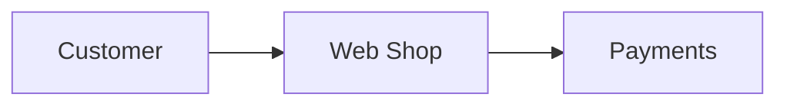

# Coexistence

A Mermaid diagram (built-in Markdown Mermaid support or a Mermaid extension):


```mermaid
graph LR
  A[Customer] --> B[Web Shop]
  B --> C[Payments]
```

A LikeC4 view:

```likec4-view project=shop
index
```
